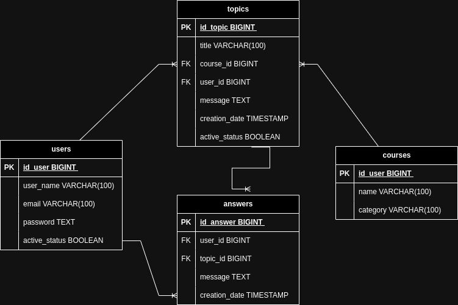

# REST API Foro Hub Challenge

# Index
- [API Documentation.](#api-documentation)
- [Description.](#description)
- [Challenges faced in the project.](#challenges)
- [Technology Stack.](#technology-stack)
- [Project Monitoring.](#project-monitoring)

### API Documentation:
Link:

### Description:
This project is a REST API for a forum where participants
of a platform can post their questions about certain topics.
This API was developed in Java with Spring Boot and a 
PostgreSQL database and is part of the specialization in 
backend with Java and Spring Framework of the ONE - Oracle
Next Education program.

- Create new topic:

The API offers functionality to create a topic, view forum 
topics, and update or delete an existing topic.

It features validators that check whether the data the user 
wants to insert, update, or delete complies with established
business rules.

- List of topics:

Additionally, the API includes support for data pagination,
which allows you to efficiently manage the display of the 
entire list of topics without exceeding the amount of data
displayed in a single query.

- Update topic:

- Delete a topic:

- ERD Database:

## Project Monitoring:
1. Create Spring Boot project.
2. Create packages.
3. Configure database connection.
4. Configure aplication.properties profiles.
5. Test the configuration with a controller.
6. Create GitHub repository.
7. Create database.
8. Create flyway migration.
9. Make ERD diagram.
10. Create the new endpoint to create a topic.
11. Add bussines rules.
12. Add validations and exceptions.
13. Create the new endpoint to update a topic.
14. Create the new endpoint to show topics.
15. Add global handling exceptions.
16. Add Spring Security dependency.
17. Configure stateless application.
18. Add JWT dependency.
19. Generate JWT.